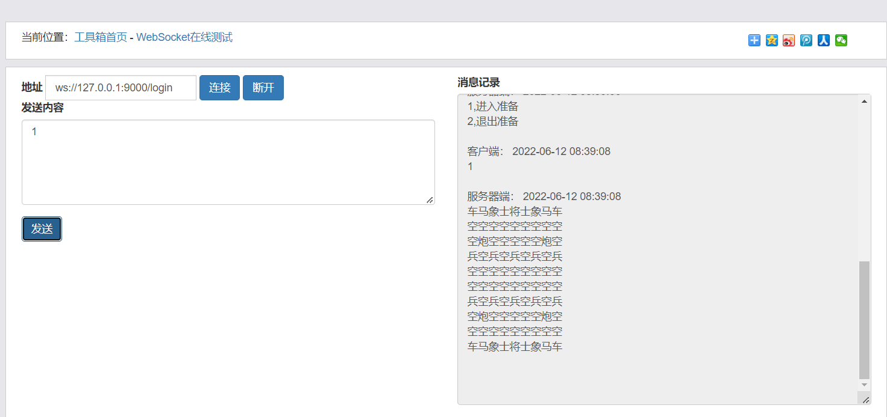

# Redrock
象棋客户端实现
##  采用 websocket 通过客户端与服务端建立连接实现通信
```go
注册 /register  
注册所需参数 username password json格式化后  
通过建立websocket 实现注册
```

~~~go

登录 /login
 // 额 由于那个客户端太折磨人了 所以 开盒即玩吧
 // 除开服务端给出的指令外 移动棋子 按照 从第一行为 0 第一列为 0 进行标记 
//  需要 用http://tool.pfan.cn/websocket 便于测试吧
// 项目已部署  地址填 ws//:110.42.216.125:9000/login

~~~
Docker构建
~~~go
docker run -d --name chess -p 9000:9000 sianao/chess
~~~
开玩
~~~go
//  登录后按照指引进去就
//  就可以开始玩了
//  基础功能逻辑上已实现 
//  就只是 那个输赢 没有去测似 (正经人谁去试试） 落子符合规划
//  符合象棋下子的规律
//  可以在准备好与没准备好之间切换
 // 环境 的话 就用了个mysql  那个将军将死的时候的判断有问题
 // 本来打算用redis 写记录每一步的步数 再实例化 但是 
 // 没来得及 能够实现多个游戏同局开玩
 // 什么 grpc  mq 一点没用上
 // (属实是我太垃圾了)
~~~
附加项
~~~go
//  可以开房间进入 和随机进入
//  可以实现多人同时观战观战
//  不知道严格按照象棋规则进
//  行走步是否算防作弊
//  实现了观战席位的人可以BB 但不让对手看见 
//  就是聊天室的实现的思路
//  不知道附图的算HTML 展示不(）
~~~
附图
